# Stored Procedures & Data Tables Interaction Diagram

## Overview

The `conformed_refactored.update_dap_data_mart()` procedure is the main orchestrator that calls all other procedures in sequence. Each procedure reads from the stage layer, uses `batch_events_refactored` as a control table to determine which events to process, and upserts into the conformed (star schema) layer.

## Diagram

```mermaid
flowchart TD
    %% ===== ORCHESTRATOR =====
    ORCH[["update_dap_data_mart()"]]

    %% ===== STORED PROCEDURES =====
    P1[["1. dim_event_upsert()"]]
    P2[["2. dim_user_journey_event_upsert()"]]
    P3[["3. dim_user_refactored_upsert()"]]
    P4[["4. dim_journey_channel_refactored_upsert()"]]
    P5[["5. dim_relying_party_refactored_upsert()"]]
    P6[["6. fact_user_journey_event_refactored_upsert()"]]
    P7[["7. event_extensions_refactored_upsert()"]]
    P8[["8. update_event_batch_table()"]]
    P9[["redshift_date_dim(start, end)"]]

    %% ===== SOURCE TABLES (Stage Layer) =====
    STG[(dap_txma_stage.txma_stage_layer)]
    STG_KV[(dap_txma_stage.txma_stage_layer_key_values)]

    %% ===== CONTROL / REFERENCE TABLES =====
    BATCH[(conformed_refactored.batch_events_refactored)]
    REF_RP[(conformed_refactored.ref_relying_parties_refactored)]

    %% ===== DIMENSION TABLES =====
    DIM_DATE[(conformed_refactored.dim_date_refactored)]
    DIM_EVENT[(conformed_refactored.dim_event_refactored)]
    DIM_UJE[(conformed_refactored.dim_user_journey_event_refactored)]
    DIM_USER[(conformed_refactored.dim_user_refactored)]
    DIM_CHAN[(conformed_refactored.dim_journey_channel_refactored)]
    DIM_RP[(conformed_refactored.dim_relying_party_refactored)]

    %% ===== FACT TABLE =====
    FACT[(conformed_refactored.fact_user_journey_event_refactored)]

    %% ===== EXTENSIONS TABLE =====
    EXT[(conformed_refactored.event_extensions_refactored)]

    %% ===== AUDIT TABLE =====
    AUDIT[(audit_refactored.audit_procedure_status)]

    %% ===== ORCHESTRATOR CALLS =====
    ORCH --> P1
    ORCH --> P2
    ORCH --> P3
    ORCH --> P4
    ORCH --> P5
    ORCH --> P6
    ORCH --> P7
    ORCH --> P8

    %% ===== P1: dim_event_upsert =====
    STG -.->|READS| P1
    BATCH -.->|READS filter| P1
    P1 ==>|UPSERTS| DIM_EVENT
    P1 -->|WRITES| AUDIT

    %% ===== P2: dim_user_journey_event_upsert =====
    STG -.->|READS| P2
    BATCH -.->|READS filter| P2
    P2 ==>|UPSERTS| DIM_UJE
    P2 -->|WRITES| AUDIT

    %% ===== P3: dim_user_refactored_upsert =====
    STG -.->|READS| P3
    BATCH -.->|READS filter| P3
    P3 ==>|UPSERTS| DIM_USER
    P3 -->|WRITES| AUDIT

    %% ===== P4: dim_journey_channel_refactored_upsert =====
    STG -.->|READS| P4
    BATCH -.->|READS filter| P4
    P4 ==>|UPSERTS| DIM_CHAN
    P4 -->|WRITES| AUDIT

    %% ===== P5: dim_relying_party_refactored_upsert =====
    STG -.->|READS| P5
    BATCH -.->|READS filter| P5
    REF_RP -.->|READS lookup| P5
    P5 ==>|UPSERTS| DIM_RP
    P5 -->|WRITES| AUDIT

    %% ===== P6: fact_user_journey_event_refactored_upsert =====
    STG -.->|READS| P6
    BATCH -.->|READS filter| P6
    DIM_DATE -.->|READS join| P6
    DIM_EVENT -.->|READS join| P6
    DIM_CHAN -.->|READS join| P6
    DIM_RP -.->|READS join| P6
    DIM_USER -.->|READS join| P6
    DIM_UJE -.->|READS join| P6
    P6 ==>|UPSERTS| FACT
    P6 -->|WRITES| AUDIT

    %% ===== P7: event_extensions_refactored_upsert =====
    STG_KV -.->|READS| P7
    BATCH -.->|READS filter| P7
    FACT -.->|READS join| P7
    DIM_EVENT -.->|READS join| P7
    P7 ==>|UPSERTS/DELETES| EXT
    P7 -->|WRITES| AUDIT

    %% ===== P8: update_event_batch_table =====
    STG -.->|READS max date| P8
    P8 ==>|UPDATES| BATCH
    P8 -->|WRITES| AUDIT

    %% ===== P9: redshift_date_dim (run independently) =====
    P9 ==>|INSERTS| DIM_DATE

    %% ===== STYLING =====
    classDef proc fill:#4a90d9,stroke:#2c5f8a,color:#fff
    classDef source fill:#f5a623,stroke:#c47d0e,color:#fff
    classDef dim fill:#7ed321,stroke:#5a9e18,color:#fff
    classDef fact fill:#d0021b,stroke:#9b0114,color:#fff
    classDef control fill:#9b59b6,stroke:#6c3483,color:#fff
    classDef audit fill:#95a5a6,stroke:#7f8c8d,color:#fff

    class ORCH,P1,P2,P3,P4,P5,P6,P7,P8,P9 proc
    class STG,STG_KV source
    class DIM_DATE,DIM_EVENT,DIM_UJE,DIM_USER,DIM_CHAN,DIM_RP dim
    class FACT fact
    class BATCH,REF_RP control
    class AUDIT audit
```



## Execution Order

The orchestrator `update_dap_data_mart()` calls procedures sequentially:

| Step | Procedure | Target Table | Action |
|------|-----------|--------------|--------|
| 1 | `dim_event_upsert()` | `dim_event_refactored` | Upsert event names from stage |
| 2 | `dim_user_journey_event_upsert()` | `dim_user_journey_event_refactored` | Upsert journey IDs from stage |
| 3 | `dim_user_refactored_upsert()` | `dim_user_refactored` | Upsert user IDs from stage |
| 4 | `dim_journey_channel_refactored_upsert()` | `dim_journey_channel_refactored` | Derive channel (Web/App/General) from event name |
| 5 | `dim_relying_party_refactored_upsert()` | `dim_relying_party_refactored` | Upsert relying party info using `ref_relying_parties_refactored` lookup |
| 6 | `fact_user_journey_event_refactored_upsert()` | `fact_user_journey_event_refactored` | Insert new events joining all dimensions; update changed records |
| 7 | `event_extensions_refactored_upsert()` | `event_extensions_refactored` | Insert/update/delete extension key-value pairs from `txma_stage_layer_key_values` |
| 8 | `update_event_batch_table()` | `batch_events_refactored` | Update watermark (`max_run_date`) per event for next run |

## Key Relationships

- **`batch_events_refactored`** acts as the incremental processing control table. Every procedure reads it to filter stage data to only process records newer than the last run watermark (`max_run_date`). It is updated last (step 8) after all other processing completes.
- **`ref_relying_parties_refactored`** is a reference/lookup table mapping `client_id` to human-readable relying party names, departments, and agencies. It is maintained by data migration scripts (not by the ETL procedures).
- **`fact_user_journey_event_refactored`** is the central fact table with foreign keys to all dimension tables.
- **`event_extensions_refactored`** stores key-value extension attributes linked to fact records via `user_journey_event_key`.
- **`dim_date_refactored`** is populated independently by `redshift_date_dim()` (not part of the ETL orchestrator).
- **`audit_refactored.audit_procedure_status`** is written to by every procedure for observability (start/complete timestamps).

## Schema Layout

```
dap_txma_reporting_db_refactored
├── conformed_refactored (schema)
│   ├── Tables
│   │   ├── dim_date_refactored
│   │   ├── dim_event_refactored
│   │   ├── dim_journey_channel_refactored
│   │   ├── dim_relying_party_refactored
│   │   ├── dim_user_journey_event_refactored
│   │   ├── dim_user_refactored
│   │   ├── fact_user_journey_event_refactored
│   │   ├── event_extensions_refactored
│   │   ├── batch_events_refactored (control)
│   │   └── ref_relying_parties_refactored (reference)
│   ├── Views
│   │   ├── vw_dim_user_refactored
│   │   ├── vw_dim_user_journey_event_refactored
│   │   └── vw_dim_journey_channel_refactored
│   └── Procedures
│       ├── update_dap_data_mart() [orchestrator]
│       ├── dim_event_upsert()
│       ├── dim_user_journey_event_upsert()
│       ├── dim_user_refactored_upsert()
│       ├── dim_journey_channel_refactored_upsert()
│       ├── dim_relying_party_refactored_upsert()
│       ├── fact_user_journey_event_refactored_upsert()
│       ├── event_extensions_refactored_upsert()
│       ├── update_event_batch_table()
│       └── redshift_date_dim()
├── dap_txma_stage (external schema, read-only)
│   ├── txma_stage_layer
│   └── txma_stage_layer_key_values
└── audit_refactored (schema)
    └── audit_procedure_status
```


Authored by Amazon Q
